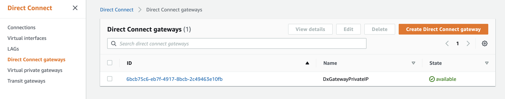
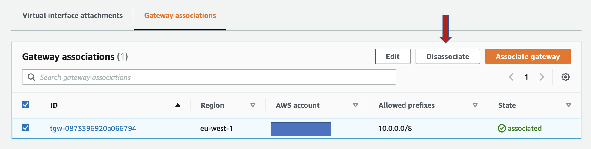

# AWS Site-to-Site VPN Private IP VPN - CDK

This repository contains AWS CDK code to deploy an AWS Site-to-Site VPN Private IP VPN over AWS Direct Connect. The following resources are created by default:

- Direct Connect gateway. By default, both examples create a new Direct Connect gateway resource. If you want to test this code over an existing Direct Connect gateway, check each specific example to understand how you can configure this.
- Customer gateway, and **AWS Site-to-Site VPN Private IP VPN**.
- AWS Transit Gateway, and one Transit Gateway Route Table where all the VPCs and the VPN will be associated and they will propagate their routes.
- Two Spoke VPCs, each of them with EC2 instances and VPC endpoints (AWS Systems Manager) to test the end-to-end connectivity.

In both examples, the following variables are defined with default values:

- ASN numbers: AWS-side (for the Transit Gateway and the Direct Connect gateway), and customer-side (for the Customer gateway).
- Transit Gateway CIDR block - used for the private Outer IPs when creating the VPN.
- Allowed prefixes - AWS-side CIDR blocks to add in the Direct Connect gateway (if created)
- Customer gateway IP - use the private IP of your device on premises.

Feel free to change these variables (check each example to see how you can do that) to build the Private IP VPN connection with values from your hybrid network.


**The resources deployed and the architectural pattern they follow is purely for demonstration/testing purposes**. Take it as an example on how to create all the necessary resources to build a Private IP VPN on top of a Direct Connect connection. The AWS Direct Connect connection and Transit VIF required to finish the end-to-end connectivity are not built in this example. The configuration of the VPN tunnels in the on-premises routers is done as an usual AWS Site-to-Site VPN connection (check the documentation in the *References* section).

## Environment Setup

If you choose an AWS Cloud9 environment, it will contain all the tools and software to use this repository right away. Alternately anything with a command line and a text editor should do the trick! You can follow the getting started guide for Cloud9 [here](https://aws.amazon.com/cloud9/getting-started/)

### CDK

If you're using Cloud9, you should already have the CDK installed (**use version 2**). Otherwise, you can follow [these instructions](https://docs.aws.amazon.com/cdk/latest/guide/getting_started.html#getting_started_install) to install the AWS CDK (version 2).

### Modules

After installing the CDK, install the required NPM modules for the project by running:

```bash
npm install
```

### Deployment Account

Configure your AWS CLI Credentials to work against the account you will deploy to.

- If you're in an AWS Cloud9 environment this should already be done for you!
- If you're not using AWS Cloud9 configure the AWS CLI using [these](https://docs.aws.amazon.com/cli/latest/userguide/cli-chap-configure.html) instructions.

Be sure to set the region to match the region you wish to deploy to. For example:

```bash
export AWS_REGION=eu-west-1
```

Run a quick test to make sure the credentials are working. The following command should list the buckets in your deployment account (if you have the right permissions):

```bash
aws s3 ls 
```

### Bootstrap

The CDK requires a place to put assets it builds.  Bootstrap this account to handle this by running. **If you've done this before in this account you can skip this step.**

```bash
cdk bootstrap
```

## Deployment instructions

The initial parameters can be found in *config/parameters.yaml*. There you can find the default values of the variables needed to build the environment:

```yaml
AppName: "private-ip-vpn-example"

ASNNumbers:
  AmazonSideDXGW : 64531
  AmazonSideTGW : 64532
  CustomerSide : 64533

Parameters:
  TGWCIDR : "10.0.0.0/24"
  DXPrefixes : "10.0.0.0/8"
  CGWIP : "10.0.0.1"

VPCA:
  CIDR: "10.0.1.0/24"
  CIDRtoTGW: "10.0.2.0/24"

VPCB:
  CIDR: "10.0.2.0/24"
  CIDRtoTGW: "10.0.1.0/24"
```

## Configure

Create your own configuration file in the 'config' folder in this project, or deploy using the sample configuration file `parameters.yaml`. Feel free to change the default values to ones more suitable for your environment. Remember the Direct Connect and Transit VIF are not created in this example, so the on-premises values provided are not real - provide yours to build end-to-end connectivity.

Copy this file to a new file, and set it up the way you want for a deployment!

### Synth Test

After your configuration is set up the way you wish, execute this command to verify the configuration file contents are correct.

**NOTE**: Nothing gets deployed by a 'synth' command, but instead it just validates the configuration contents and generates templates in the `cdk.out` folder.

You will need pass the configuration file as an option on the command line.

```bash
cdk synth PreparationStack -c config=[configuration-file]
cdk synth VpnStack -c config=[configuration-file]
```

Replace `[configuration-file]` with the filename in the 'config' directory you want to synth, or use the sample configuration `parameters`. Errors in the configuration file will be caught and shown.

### Deploy

Once you're comfortable that everything looks good, you can first deploy the preparation stack with all the required components to later deploy the VPN, by running:

```bash
cdk deploy PreparationStack -c config=[configuration-file]
```

And when the Transit Gateway attachment is in the 'available' state, you can deploy the Private IP VPN by running:

```bash
cdk deploy VpnStack -c config=[configuration-file]
```

Replace `[configuration-file]` with the filename in the 'config' directory you want to deploy, or use the sample configuration `parameters`.

### Clean up

After completing your demo, delete the two AWS CloudFormation Stack created using AWS CDK command:

```bash
cdk destroy VpnStack
```

In order to continue with the second stack deletion, first disassociate the AWS Transit Gateway from the AWS DirectConnect Gateway:

1. Go to AWS DirectConnect Gateway console

2. Select the AWS DXGW created and go to the *Gateway associations* tab

3. Click on the orange button and Disassociate
4. Once in the Gateway associations tab, the AWS TGW is disassociated (takes 20min aprox.) delete the last stack with the following command:

```bash
cdk destroy PreparationStack
```

## References

- AWS Blog: [Introducing AWS Site-to-Site VPN Private IP VPNs](https://aws.amazon.com/blogs/networking-and-content-delivery/introducing-aws-site-to-site-vpn-private-ip-vpns/)
- AWS Documentation: [AWS Site-to-Site VPN - Getting Started](https://docs.aws.amazon.com/vpn/latest/s2svpn/SetUpVPNConnections.html)

## Security

See [CONTRIBUTING](CONTRIBUTING.md#security-issue-notifications) for more information.

## License

This library is licensed under the MIT-0 License. See the LICENSE file.
