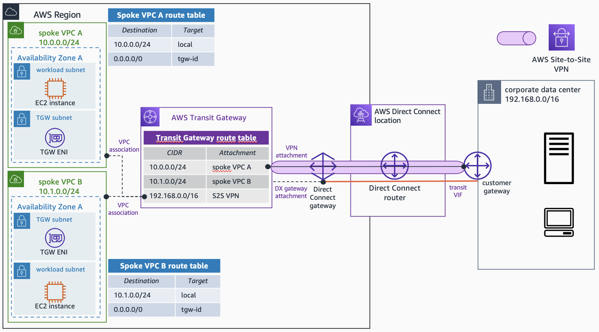

# AWS Site-to-Site VPN Private IP VPN - Terraform

This repository contains terraform code to deploy an AWS Site-to-Site VPN Private IP VPN over AWS Direct Connect. The following resources are created by default:

- Direct Connect gateway. By default, both examples create a new Direct Connect gateway resource. If you want to test this code over an existing Direct Connect gateway, check each specific example to understand how you can configure this.
- Customer gateway, and **AWS Site-to-Site VPN Private IP VPN**.
- AWS Transit Gateway, and one Transit Gateway Route Table where all the VPCs and the VPN will be associated and they will propagate their routes.
- Two Spoke VPCs, each of them with EC2 instances and VPC endpoints (AWS Systems Manager) to test the end-to-end connectivity.

In both examples, the following variables are defined with default values:

- ASN numbers: AWS-side (for the Transit Gateway and the Direct Connect gateway), and customer-side (for the Customer gateway).
- Transit Gateway CIDR block - used for the private Outer IPs when creating the VPN.
- Allowed prefixes - AWS-side CIDR blocks to add in the Direct Connect gateway (if created)
- Customer gateway IP - use the private IP of your device on premises.

Feel free to change these variables (check each example to see how you can do that) to build the Private IP VPN connection with values from your hybrid network.

**The resources deployed and the architectural pattern they follow is purely for demonstration/testing purposes**. Take it as an example on how to create all the necessary resources to build a Private IP VPN on top of a Direct Connect connection. The AWS Direct Connect connection and Transit VIF required to finish the end-to-end connectivity are not built in this example. The configuration of the VPN tunnels in the on-premises routers is done as an usual AWS Site-to-Site VPN connection (check the documentation in the *References* section).

## Deployment instructions

- Clone the repository
- Edit the *variables.tf* file (in the root directory) to configure the AWS Region to use, the project identifier, and the number of Availability Zones to use. Edit the *locals.tf* (in the root directory) to configure the VPCs to create.
- To change the configuration about the Security Groups and VPC endpoints to create, edit the *locals.tf* file in the project root directory.
- Initialize Terraform using `terraform init`.
- Now you can deploy the rest of the infrastructure using `terraform apply`.
- To delete everything, use `terraform destroy`.

**Note** The default number of Availability Zones to use in the VPCs is 1. To follow best practices, each resource - EC2 instance, and VPC endpoints - will be created in each Availability Zone. **Keep this in mind** to avoid extra costs unless you are happy to deploy more resources and accept additional costs.

## References

- AWS Blog: [Introducing AWS Site-to-Site VPN Private IP VPNs](https://aws.amazon.com/blogs/networking-and-content-delivery/introducing-aws-site-to-site-vpn-private-ip-vpns/)
- AWS Documentation: [AWS Site-to-Site VPN - Getting Started](https://docs.aws.amazon.com/vpn/latest/s2svpn/SetUpVPNConnections.html)

## Security

See [CONTRIBUTING](CONTRIBUTING.md#security-issue-notifications) for more information.

## License

This library is licensed under the MIT-0 License. See the LICENSE file.
